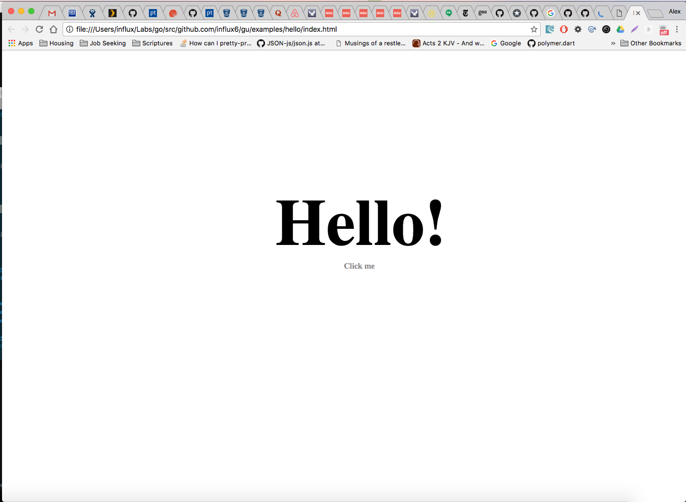
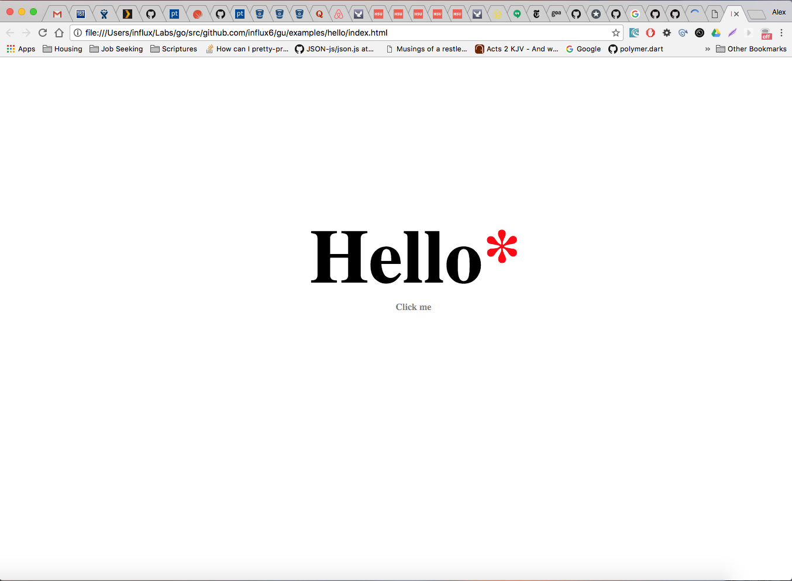
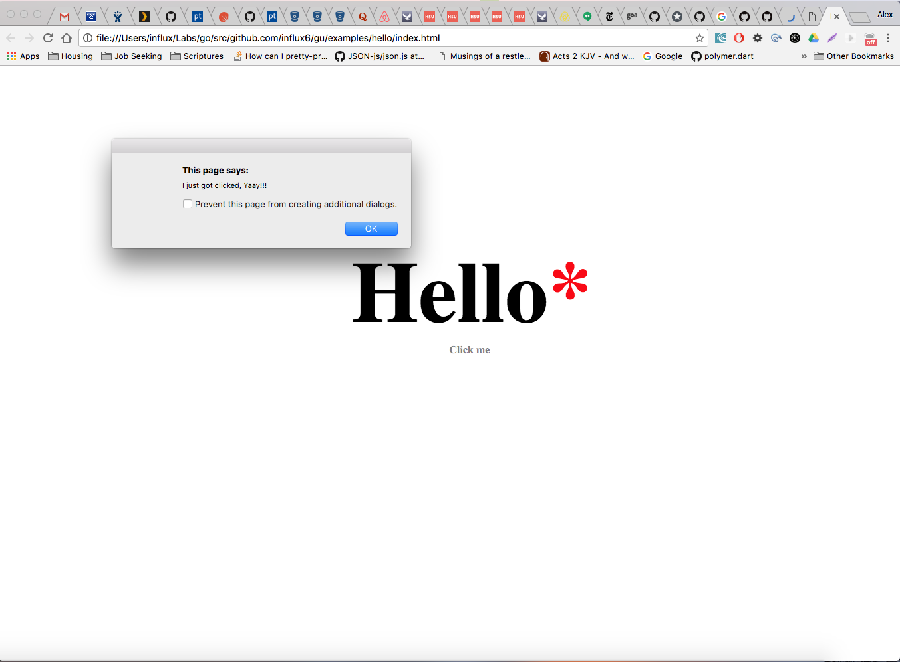
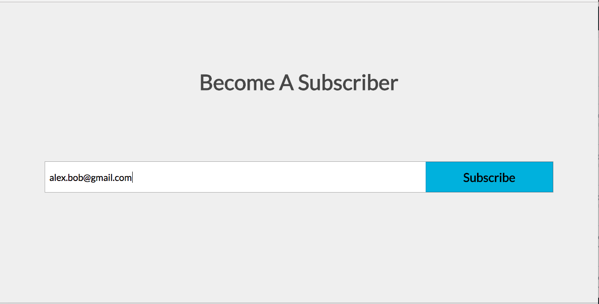
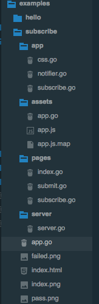

# Getting Started 
Gu is fundamentally a library built to handle view rendering, nothing more nor less.
When creating Gu, my main focus was on creating a solution that did not bind itself 
tightly to the perculiarities of either the frontend or backend, but allow each content to 
be renderable regardless of where it is loaded. 

The concepts in Gu are practially simple and rely majorly on a functional and interface based system,
where the structures which define the markup to be rendered are combined functionally and components 
are required to match/implement specific interfaces to enable specific features eg Reaction for page/view update.

Gu is in no way a Flux-like framework or library, nor does it provide complex structures and 
layed down paths by which such can be attained, It simply provides a baseline to render the desire output and 
gives the freedom for the developer to determine how his/her application data flow  works.


## The Guide
In this guide, we simply will be looking at Gu is its only two possible representation 
or in essense, the two ways you will ever use its constructs, which are as a `Page` and as `Component`. 
This allows you to grasp the available spectrum and capabilities provided by Gu and 
to evolve and define for yourself how you wish to mix and match Gu into your projects and workflow.

*Gu has evolved over its development lifetime alot, loosing and adding new ideas into the way it works but 
I have ensured to keep the tenant of simplicity and a non-intrusive architecture, that greatly meet the rendering 
needs of the developer and also grant freedom in how it should be used with in projects.*

### A Page
The Page approach is pretty much as its called, a "Page".  Combining ideas from [Goa](https://goa.design/) in 
the way its structures are defined and generated, Gu's [Design Package](./designs) defines structures which 
unlike [Goa](https://goa.design/)  do not provide any form of code generation but produces the desired effect of defining with intent 
the content expected on a page. In a sense, it is the organizational structure when wanting to define multipage or 
single page applications with gu.

Basically a page is a resource amongs many resources which depending on the availability
of a predefined route to be validated against, will be rendered.  On the client side this means any resource which 
matches the current URL hash which gets rendered onto the browser DOM, while on the client it is the 
URL provided to generated a complete html response to render a full page 
with its differents parts (i.e head, links, scripts, styles and body tags).

Pages on the client listen for update requests from the things they render if this matches the library reaction interface, 
which effectively provides a easy but simply way  for developers to build reactivity to changes in structures.

With Pages in Gu, comes the concept of a ResourcesManager, this manager is created to managed and handle 
the response and rendering of all pages according to the current requested URI on the client and on the server
the provided URI. Generally a Resource/Page object, are not directly handled by the  developer has they are 
generated by the internals of  Gu's [Design Package](./designs) during initialization and runtime.  

As a note, what defines the criteria for which page or pages get rendered by the ResourcesManager is the routes 
to which this resources get pegged down to, if no route is provided then it is understood that the page is simply 
a part of any URI to be rendered. This is intentional but not advised has structurally and organization wise, resources 
should be self encapsulating of their entire components and parts.

Creating a page is rather simple has it requires the calling of the Resource function which embodies the 
content or intent of content for that page through the provided functions and structures Gu provides.

Below is an example of a page which a single Hello text printed on the page.

```go
package main

import (
  "github.com/gopherjs/gopherjs/js"
  . "github.com/influx6/gu/design"
  . "github.com/influx6/gu/trees"
  . "github.com/influx6/gu/trees/elems"
  . "github.com/influx6/gu/trees/events"
  . "github.com/influx6/gu/trees/property"
)

var _ = Resource(func() {

    DoTitle("Hello App")

    DoMarkup(func() *Markup {
      return Div(
        CSS(`
          ${
            width:100%;
            height: 100%;
          }

          $ h1 {
            font-size: {{ .Size }};
            text-align: center;
            margin: 20% 0  0 5%;
          }

          $ span {
            text-align: center;
            font-weight: bold;
            margin: 0 0 0 50%;
            color: rgba(0,0,0,0.5);
          }

          $ h1::after{
            content:"!";
            display: inline-block;
          }

          $ h1:hover::after{
            content:"*";
            color: red;
            display: inline-block;
          }

        `, struct{ Size string }{Size: "130px"}),
        IDAttr("hello"),
        Header1(
          Text("Hello"),
          ClickEvent(func(ev EventObject, tree *Markup) {
            js.Global.Call("alert", "I just got clicked, Yaay!!!")
          }, ""),
        ),
        Span(Text("Click me")),
      )
    }, "", false)

  })


func main(){
	New(&redom.DOMRenderer{
		Document: dom.GetWindow().Document(),
	}).Init(true)
}
```

Rendered Page:


Rendered Page with Hover Effect:


Rendered Page with clicked "Hello" text:


The code above flurishes with  declarations of  intent which when read fully describes the
outcome expected on the page. As stated within Gu, a Resource is a single page, which encapsulates
 what is expected with its logic and architecture which then gets rendered as a page based on the URI
 critieria.

We create a resource by calling the [Design Package](../../designs) `Resource` function which generates 
a function to be instantiated and executed by the managing `ResourcesManager` to create the resource.
It simple returns the index position which that resource will be located in within the `ResourcesManager`.
But this is usually not needed but also exists to allwo the pattern of declaration.
```go
var _ = Resource(func() {
    ....
})
```

The main function handles the creation of the `ResourcesManager` by calling the `New`
function from the [Design Package](../../designs) package. The `ResourcesManager` expects an an optional 
argument, which is a `ResourceRenderer` type to handle the rendering of the resources on the client.
The   `ResourceRenderer` if passed in will only be ever used on the client, to handle the automatic update of the DOM
during the initial load and continous updates request either by a component or the browsers URI.

```go
	New(&redom.DOMRenderer{
		Document: dom.GetWindow().Document(),
	}).Init(true)
```

**Note**: The `Init()` function is the core of a `ResourcesManager` to intialize all present `Resource` functions 
already loaded either as part of the package or from an externally imported package. Which brings me to the need to 
explain how the `New` works. The `design.Resource(func())` works by stacking the provided function in a global 
resource stack, when the `New` function is called to create a `ResourcesManager`, it takes all available functions 
added into the package resource stack, clearing out all. This is done to ensure only the `ResourcesManager` created
ever owns those resources. Generally there should ever be only one `ResourcesManager` created and passed to 
either your client or server code, has it works on either end.

We continue in the Resource function which immediately sets the route to be targeted for which this `Resource`
should be rendered, now this particular code is excluded in the example code but added here for breadth and also 
to provide the opportunity to showcase how a Resource is locked to a given URI, generally by the hash of the page.
```go
	UseRoute("/hello")
```

Next we set the title expected for the page, by calling the `DoTitle` function which ensures a `<title>`tag is included 
in the head, thereby setting the seen title when this is rendered.
```go
	DoTitle("Hello App")
```

The final piece the page is the simple markup we intently desire that the page display, which is a simple "Hello Text"
with a faded "Click Me!" below it.

```go
DoMarkup(func() *Markup {
      return Div(
        CSS(`
          ${
            width:100%;
            height: 100%;
          }

          $ h1 {
            font-size: {{ .Size }};
            text-align: center;
            margin: 20% 0  0 5%;
          }

          $ span {
            text-align: center;
            font-weight: bold;
            margin: 0 0 0 50%;
            color: rgba(0,0,0,0.5);
          }

          $ h1::after{
            content:"!";
            display: inline-block;
          }

          $ h1:hover::after{
            content:"*";
            color: red;
            display: inline-block;
          }

        `, struct{ Size string }{Size: "130px"}),
        IDAttr("hello"),
        Header1(
          Text("Hello"),
          ClickEvent(func(ev EventObject, tree *Markup) {
            js.Global.Call("alert", "I just got clicked, Yaay!!!")
          }, ""),
        ),
        Span(Text("Click me")),
      )
    }, "", false)
```

The `DoMarkup` function accepts three types of input:

  1. A `Markup` structure provided by the `trees`, `trees\elems` and `trees\property` packages.
  2. A function which returns a single or a slice/list of markup structures (When a list is returned it gets wrap in a section tag)
  3. A string which will be parsed to generate the markup structure representing it.

The use of a functional style allows us to easily and intently describe the structure 
for any markup combination and grants us the full power of functional Go.

The special item in all the structures provided is the `CSS` function which will 
take the style properties described into it and create a `<style>` that whoes content
is the string within and where all `$` characters are replaced by the parents unique 
UUID. This ensures that whatever properties are defined are enforced to only apply to 
the parent and its children.

The `DoMarkup` as well as an alternative function within the `gu/design` package,
called the `DoView`.

```go
type ReactiveSubscription interface {
	React(func())
}

type Reactive interface {
	ReactiveSubscription
	Publish()
}
```

The `DoView` provides an alternative which focus more on a region of markup which 
is dynamic and changes due to some operation, data or condition. The view automatically 
updates itself content based on the `Reactive` interface for any structure which meets 
that interface.

*The basic rules of choosing between `DoMarkup` and `DoView` is simply on the basis of 
whether the contents and its data are dynamic and dependent on some system, data or 
structure which changes and requires efficient update.*

```go
type Renderable interface {
	Render() *trees.Markup
}
```

The `DoView` expects as input on structures which matches the `Renderable` interface
and then passes those to build its markup output. If any of these structures implement 
the `Reactive` interface then it subscribes to listen for changes updates and updates 
the renderered content if on the client automatically. Which ensures such dynamic 
regions and data keep updated without any effort on the developers side.


### A Component
Component are the secondary system Gu caters to. Components are represented as views 
or regions of markup which are dynamic and change, even if they are not dynamic, they 
are region which are fed their markup by external structures that meet the `Renderable`
interface.

We will be building a simple email subscription app has displayed by the images below.
This example show cases well enough how components can be built with `Gu` and how 
communicating between components is highly decoupled and allows and ensures that 
each component encapsulates its markup and behaviour(i.e events, look and feel).

Rendered Page:


Rendered Page when subscription passes:


Rendered Page when subscription fails:


The app is simple in that it requires entering an email address which is supposed
to added to the App mailing list and returns either a pass or failure as to the end 
result of such a subscription. In truth we won't be adding the functionality of calling 
an external API has this only demonstrates how components can be built but assurdedly 
the code will be completed on the basis of component creation and intercommunication.

When building the sample App, file structure wise things were arranged in an order 
which described best the contents and order in which the App was to be built.


