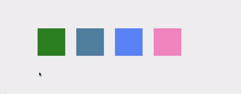

# RestfulBoxes
RestfulBoxes provides an example of using Gu with a http backend to create components
which define their look by the data they receive. The example code is highly trivial but helps demonstrates the simplicity of the approach.



## Run
Simple navigate into the `./server` directory in your terminal and run as below.

```bash
go run main.go
```

Navigate your browser to `http://localhost:6040`
